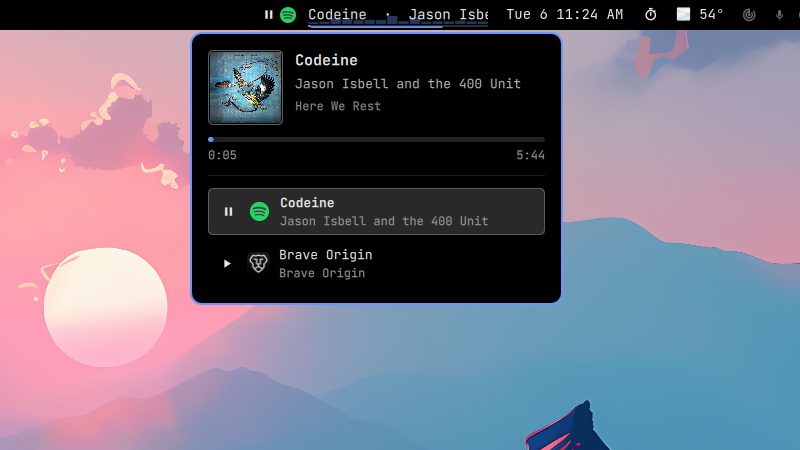

# Media Now Playing

Omarchy MPRIS now playing bar plugin with cava visualization.



Media Now Playing replaces Omarchy's built-in Media bar widget with a keyboard-first
version: the bar shows what's playing, and a single click opens a dropdown with
the album art. Playback itself stays on your media keys.

## Features

- **Bar widget**
  - Play/pause state icon, the playing app's icon, and the track title and artist
  - Title text always scrolls, as a visual cue that something is playing
  - A thin progress underline beneath the title, in your theme's accent color
  - A small [cava](https://github.com/karlstav/cava) audio visualizer drawn behind the title while music plays
- **Dropdown** (left-click the widget)
  - Album art, title, artist and album
  - Progress bar with elapsed and total time
  - Every open media source, with its app icon and the active one highlighted
- **Keyboard first**: the only mouse action is opening the dropdown. Play/pause,
  next, previous and source switching are left to your keybinds.
- **Drop-in replacement** for the built-in `omarchy.media` plugin. Omarchy's media
  keybinds, the audio panel and the media OSD keep working unchanged.

## Prerequisites

- Omarchy 4 (Quattro)
- **cava**, which draws the visualizer. It isn't installed with Omarchy by default:

  ```bash
  omarchy pkg add cava
  ```

## Install

```bash
omarchy plugin add https://github.com/mrjohnnycake/omarchy-now-playing.git --enable
```

Enabling Media Now Playing puts it in the built-in Media widget's place in the bar and
switches off the built-in media service, so only one plugin answers your media
keys. Your bar layout is otherwise left alone.

If you install without `--enable`, enable it later with:

```bash
omarchy plugin enable mrjohnnycake.now-playing
```

## Usage

| Action | Result |
|---|---|
| Left-click the widget | Open or close the dropdown |
| Hover the widget | Tooltip with title and artist |
| Media keys | Handled through Omarchy's `omarchy-shell media …` commands, as with the built-in plugin |

## Optional: media keys that work without any media plugin

Omarchy's media keybinds call `omarchy-shell media …`, which only works while a
media plugin (this one or the built-in) is enabled. `extras/media-key.sh` tries
the shell first and, if no plugin answers, controls MPRIS players directly over
D-Bus, so your keys keep working with the plugin disabled.

1. Copy the script somewhere outside the plugin folder, so removing the plugin
   doesn't break your keys:

   ```bash
   mkdir -p ~/.local/bin
   cp ~/.config/omarchy/plugins/mrjohnnycake.now-playing/extras/media-key.sh ~/.local/bin/
   chmod +x ~/.local/bin/media-key.sh
   ```

2. Replace Omarchy's media binds in `~/.config/hypr/bindings.lua`:

   ```lua
   local mediaKey = "$HOME/.local/bin/media-key.sh"

   hl.unbind("XF86AudioNext")
   hl.unbind("ALT + XF86AudioPlay")
   hl.unbind("XF86AudioPause")
   hl.unbind("XF86AudioPlay")
   hl.unbind("XF86AudioPrev")
   hl.unbind("ALT + SHIFT + XF86AudioPlay")
   hl.unbind("SHIFT + XF86AudioPause")
   hl.unbind("SHIFT + XF86AudioPlay")

   o.bind("XF86AudioNext", "Next track", mediaKey .. " next", { locked = true })
   o.bind("ALT + XF86AudioPlay", "Next track", mediaKey .. " next", { locked = true })
   o.bind("XF86AudioPause", "Pause", mediaKey .. " playPause", { locked = true })
   o.bind("XF86AudioPlay", "Play", mediaKey .. " playPause", { locked = true })
   o.bind("XF86AudioPrev", "Previous track", mediaKey .. " previous", { locked = true })
   o.bind("ALT + SHIFT + XF86AudioPlay", "Previous track", mediaKey .. " previous", { locked = true })
   o.bind("SHIFT + XF86AudioPause", "Switch media source", mediaKey .. " sourceSwitch", { locked = true })
   o.bind("SHIFT + XF86AudioPlay", "Switch media source", mediaKey .. " sourceSwitch", { locked = true })
   ```

3. Reload Hyprland and check for errors:

   ```bash
   hyprctl reload && hyprctl configerrors
   ```

The script accepts `playPause`, `next`, `previous`, `sourceSwitch` and
`sourceSwitchPrevious`. Without a plugin there's no on-screen popup.

## Configuration

- **Visualizer**: bar count, frame rate and audio input are in `cava.conf`.
- **Visualizer opacity** (`opacity: 0.35` on `cavaLayer`) and the **title width**
  (`maxLabelWidth: 180`) are in `BarWidget.qml`.

Edits to an installed plugin are overwritten by `omarchy plugin update`.

## Remove

```bash
omarchy plugin remove mrjohnnycake.now-playing
```

Removing the plugin restores Omarchy's built-in Media widget and media service.

If you set up the optional media key script, also remove the `mediaKey` lines from
`~/.config/hypr/bindings.lua` and delete `~/.local/bin/media-key.sh`. Omarchy's
default media binds come back on the next Hyprland reload.

To remove cava as well:

```bash
omarchy pkg drop cava
```

## Notes

- The visualizer reacts to everything playing through your default audio output,
  not only the active player.
- Cava runs only while the active player is playing, and stops when paused.
- Some players, such as browser tabs, don't report a track length. The progress
  underline and progress bar are hidden for them.

## License

MIT. See [LICENSE](LICENSE). Parts of this plugin are derived from Omarchy's
built-in media plugin (`omarchy.media`), © David Heinemeier Hansson, also MIT.
